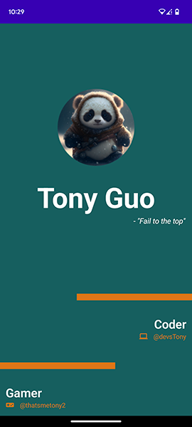

# BusinessCard

BusinessCard is a simple Android app created using Jetpack Compose. It allows users to create and share digital business cards with their contact information. This project was my first experience with Jetpack Compose and was designed using Figma. All resources and designs used in the app were either created by me or chosen by me.

## Dependencies

- Jetpack Compose: The modern UI toolkit for building native Android apps.
- Figma: Used for designing and prototyping the app's user interface.

## Screenshots

  

